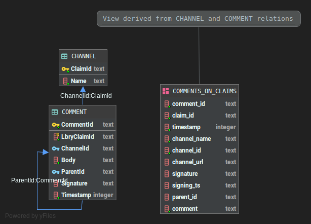

# LBRY Comment Server


## Installation

Firstly you'll need to install and run the `lbrynet` daemon,
the details of which can be found [here](https://github.com/osilkin98/lbryio/lbry).

Installing the server:
```bash

$ git clone https://github.com/osilkin98/comment-server
$ cd comment-server

# create a virtual environment
$ virtualenv --python=python3 venv

# Enter the virtual environment
$ source venv/bin/activate

# install the library dependencies
(venv) $ pip install -r requirements.txt
```

## Usage


First, make sure that the LBRY API server is running, 
to do so you can run the following:
 
 ```bash
 (venv) $ curl  --data '{ "method": "status"}' http://localhost:5279/ | grep is_running
 
 # Or from the lbrynet virtual environment:
 (lbry-venv) $ lbrynet status | grep is_running
 ```

Then to start the server, simply run:
```bash
(venv) $ python -m main &  
```

## Schema



## About
A lot of the design is more or less the same with the original,
except this version focuses less on performance and more on scalability.

Rewritten with python because it's easier to adjust
and maintain. Instead of doing any multithreading,
this implementation just delegates a single
database connection for write operations.

The server was originally implemented with `aiohttp`
and uses `aiojobs` for scheduling write operations.
As pointed out by several people, Python is a dinosaur
in comparison to SQLite's execution speed,
so there is no sensibility in multi-threading from the
perspective of the server code itself.
